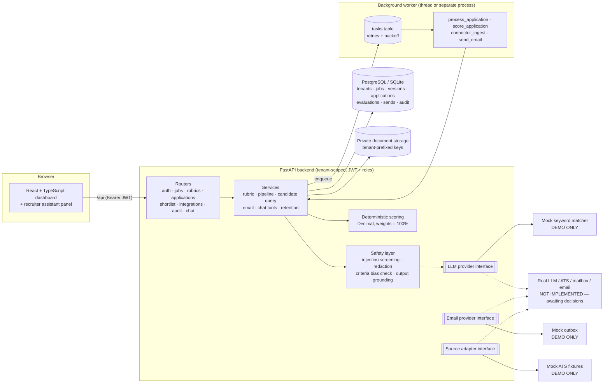
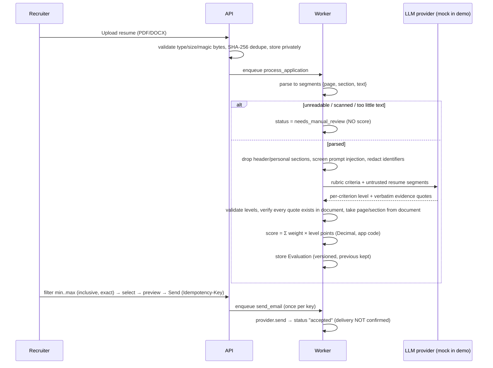
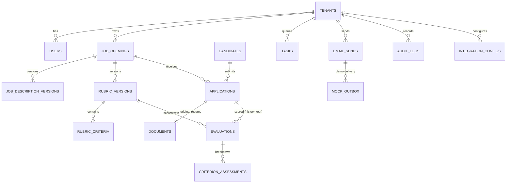

# TalentMatch AI — Architecture (Milestone 1)

## 1. Overview



### Scoring pipeline



## 2. Key design decisions

| Concern | Decision |
|---|---|
| Score meaning | Rubric alignment 0–100, **not** a hiring probability. Never derived from embedding similarity. |
| Who computes the score | Application code (`app/scoring.py`). The LLM only proposes rubric criteria and assigns a discrete level + evidence per criterion. |
| Levels | strong 1.0 · substantial 0.75 · partial 0.5 · limited 0.25 · none 0. Contribution = weight × points. |
| Precision | Decimal arithmetic; stored as integer `score_e4` (1/10000). Filters compare integers → exact, inclusive. UI shows 2 decimals unless more precision exists, then 4. |
| Required criteria | Tracked separately: supported / needs clarification / not supported. Separate filter. Never auto-rejects. |
| Missing evidence | Reported as "not found in resume text"; explicitly not proof the candidate lacks it. |
| Unreadable resumes | `needs_manual_review`, no evaluation row, excluded from score filters, still visible in "all applications". |
| Extraction confidence | Stored on the document and evaluation, shown separately from the score. |
| Versioning | Job description versions, rubric versions (draft → approved → superseded, approved immutable), scoring logic version, model config snapshot on every evaluation. Re-approval rescores and keeps history. |
| Untrusted content | Resumes/JDs are data. Injection-like lines are excluded from model input and flagged; prompt builder JSON-encodes text inside a labelled data block; model output is schema-checked and every quote must exist in the document. |
| Fairness | Header/contact and "personal" sections excluded; names, emails, phones, URLs, DOB/age, gender/marital/etc. terms redacted; rubric criteria referencing protected characteristics or school prestige are rejected at approval. |
| Tenant isolation | `tenant_id` on every row; every query filters on it; cross-tenant IDs return 404; tasks carry tenant_id and re-check ownership; storage keys are tenant-prefixed and checked after path resolution. |
| Email safety | Explicit recruiter send action only; ≥1 candidate and valid recipient required; external domains need explicit confirmation; attachments off by default and controlled by tenant policy; idempotency key + unique constraint prevents duplicates; "accepted" ≠ delivered. |
| Vector retrieval | Not used. Matching is structured and evidence-based; add retrieval only with a demonstrated need (e.g. very long documents). |

## 3. Database schema



| Table | Key columns |
|---|---|
| `tenants` | id, name, slug, allowed_email_domains[], allow_resume_attachments, retention_days |
| `users` | id, tenant_id, email (unique), full_name, role (`admin`/`recruiter`/`hiring_manager`), password_hash (PBKDF2), is_active |
| `job_openings` | id, tenant_id, title, department, location, status, external_ref (ATS requisition), active_rubric_version_id |
| `job_description_versions` | id, tenant_id, job_id, version (unique per job), text, source (`pasted`/`uploaded`), created_by_id |
| `rubric_versions` | id, tenant_id, job_id, version, job_description_version_id, status (`draft`/`approved`/`superseded`), proposed_by, model_config (json), scoring_logic_version, approved_by_id, approved_at |
| `rubric_criteria` | id, rubric_version_id, position, name, category, description, weight, required, evidence_terms[] |
| `candidates` | id, tenant_id, full_name, email, external_candidate_id |
| `applications` | id, tenant_id, job_id, candidate_id, external_application_id, source_system, submitted_at, status, status_detail, flags[], flag_details[], duplicate_of_id — unique (tenant_id, source_system, external_application_id) |
| `documents` | id, tenant_id, application_id, original_filename, content_type, size_bytes, sha256, storage_key, parse_status, parse_error, page_count, segments (json), extracted_char_count, extraction_confidence, extraction_notes |
| `evaluations` | id, tenant_id, application_id, rubric_version_id, score_e4 (int), required_status, extraction_confidence, supported_terms, missing_terms, is_mock, is_current, scoring_logic_version, model_config |
| `criterion_assessments` | id, evaluation_id, criterion_id, criterion_name/category/weight/required (snapshot), level, level_points, contribution_e4, required_status, evidence[] {quote, page, section, segment_index}, supported_points, missing, ambiguities, rationale |
| `tasks` | id, tenant_id, type, payload, status (`queued`/`running`/`done`/`failed`), attempts, max_attempts, last_error, run_after |
| `email_sends` | id, tenant_id, job_id, sender_id/email, idempotency_key (unique per tenant), request_fingerprint, to/cc/external_recipients, subject, body_text, rendered_text, include_attachments, score_min/max, application_ids, status, delivery_status, provider, provider_message_id, failure_detail, accepted_at |
| `mock_outbox` | id, tenant_id, email_send_id, from, to, cc, subject, body, attachments |
| `audit_logs` | id, tenant_id, user_id, actor_email, action, entity_type, entity_id, details (never resume text), created_at |
| `integration_configs` | id, tenant_id, kind (unique per tenant), name, enabled, status, settings (non-secret), last_sync_at, last_result |

Milestone 1 creates tables with `create_all`. Alembic migrations are production work.

## 4. Repository structure

```
talentmatch-ai/
├── README.md                     setup + run on Windows 11 / VS Code
├── .env.example                  environment placeholders (copy to .env)
├── docker-compose.yml            PostgreSQL + API + worker + web (untested)
├── .vscode/                      tasks (run API/Web/tests) and interpreter settings
├── docs/
│   ├── ARCHITECTURE.md           this file
│   ├── API.md                    endpoint reference
│   └── STATUS.md                 implemented vs mocked vs remaining + open questions
├── backend/
│   ├── requirements.txt, pytest.ini, Dockerfile
│   ├── app/
│   │   ├── main.py               FastAPI app, CORS, lifespan (starts worker thread)
│   │   ├── worker.py             standalone worker process
│   │   ├── config.py db.py models.py
│   │   ├── security.py deps.py   JWT, password hashing, permissions, tenant-scoped lookups
│   │   ├── files.py parsing.py   upload validation, PDF/DOCX → segments
│   │   ├── safety.py             injection screening, redaction, prohibited-criteria check
│   │   ├── scoring.py            deterministic weighted scoring
│   │   ├── storage.py audit.py
│   │   ├── llm/                  provider interface, prompts, MOCK provider, factory
│   │   ├── ingestion/            source adapter interface, MOCK ATS adapter
│   │   ├── services/             pipeline, rubric, candidate query, email, chat tools, tasks, retention
│   │   ├── routers/              HTTP endpoints
│   │   ├── demo/resumes.py       synthetic JD + resumes + edge-case files
│   │   └── seed.py               demo seeding
│   ├── demo_data/                generated synthetic resumes + mock ATS fixtures
│   └── tests/                    pytest suite (54 tests)
└── frontend/
    ├── package.json vite.config.ts tsconfig.json index.html
    └── src/
        ├── App.tsx main.tsx state.tsx api.ts format.ts types.ts styles.css
        ├── components/           ui primitives, ChatPanel
        └── pages/                Login, Jobs, JobEditor, Ingestion, Results,
                                  CandidateDetail, Shortlist, Integrations, Audit
```
